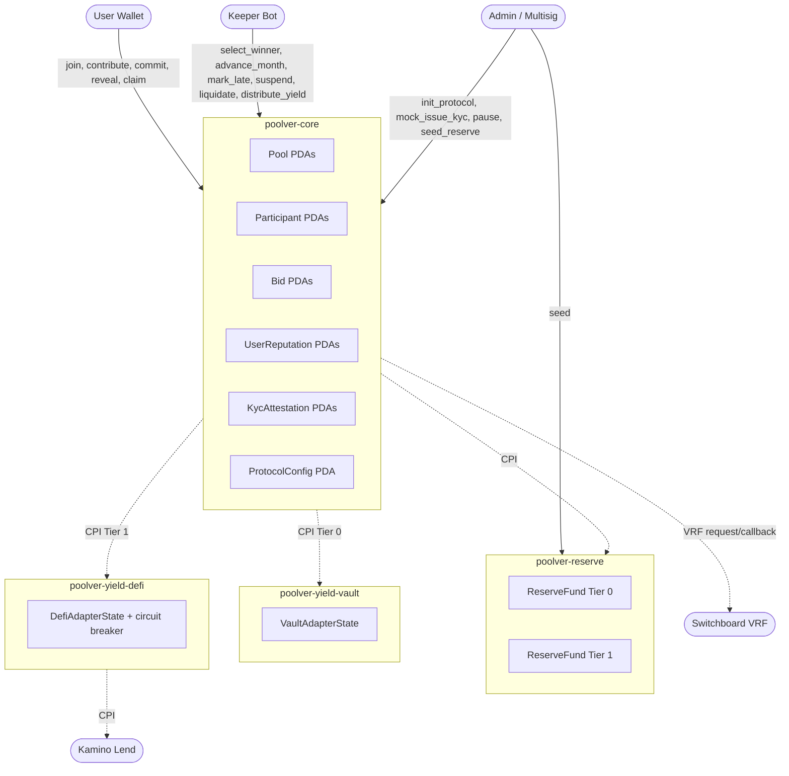
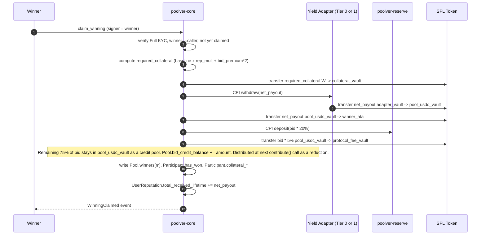
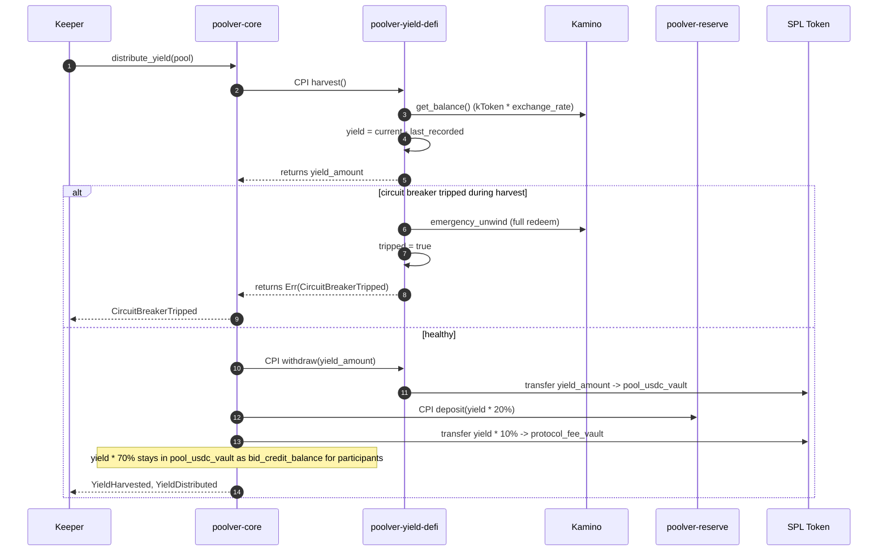

# Poolver V1 — Architecture

> **Status:** Architecture phase output. Produced by `solana-architect` per SPEC_V1 §0/§14.
> **Source of truth for divergence:** `docs/SPEC_V1.md`. If this document and the spec disagree, the spec wins; raise a `QUESTIONS.md` entry.
> **Audience:** A Solana engineer who knows Anchor and the SPL token model but is opening this codebase for the first time.

---

## Table of Contents

1. [Component Overview](#1-component-overview)
2. [Sequence Diagrams](#2-sequence-diagrams)
3. [Account Layouts](#3-account-layouts)
4. [PDA Seed Table](#4-pda-seed-table)
5. [CPI Matrix and Authentication](#5-cpi-matrix-and-authentication)
6. [Compute Budget Analysis](#6-compute-budget-analysis)
7. [Account Size at the Limit (`Pool`)](#7-account-size-at-the-limit)
8. [Transaction Size & Account Audit](#8-transaction-size--account-count-audit)
9. [VRF Integration Pattern](#9-vrf-integration-pattern)
10. [Mock KYC Compile-Time Guard](#10-mock-kyc-compile-time-guard)
11. [Reserve Isolation Enforcement](#11-reserve-isolation-enforcement)
12. [Solvency Invariant — Proof Sketch](#12-solvency-invariant--proof-sketch)
13. [Yield Adapter Common Interface](#13-yield-adapter-common-interface)
14. [Existing Code Disposition](#14-existing-code-disposition)

---

## 1. Component Overview

### Programs

| Program | Role | Owns | Talks to |
|---|---|---|---|
| `poolver-core` | Pool lifecycle, bidding, winner selection, default cascade, mock KYC | `Pool`, `Participant`, `Bid`, `UserReputation`, `KycAttestation`, `ProtocolConfig` PDAs; `pool_vault` and `collateral_vault` token accounts | `poolver-reserve`, yield adapters, Switchboard VRF, SPL Token |
| `poolver-reserve` | Per-tier reserve fund accounting and USDC custody | `ReserveFund` PDAs (one per tier), `reserve_vault` token accounts | None outbound; receives CPIs from core |
| `poolver-yield-vault` | Tier 0 adapter — passive USDC custody | `VaultAdapterState` PDA, `adapter_usdc_vault` token account | None outbound |
| `poolver-yield-defi` | Tier 1 adapter — Kamino integration with circuit breakers | `DefiAdapterState` PDA, `adapter_usdc_vault`, `adapter_ktoken_vault` | Kamino Lend program |

### Component Diagram



### Token-Account Topology

Per pool:
- `pool_usdc_vault` — PDA-owned USDC ATA holding active liquid balance
- `collateral_vault` — PDA-owned USDC ATA holding all winners' locked collateral (single account per pool, NOT per-winner, to keep `claim_winning` light)

Global:
- `protocol_fee_vault` — PDA-owned USDC ATA receiving 1.5% protocol fees and 5% bid-distribution share
- `tier0_reserve_vault`, `tier1_reserve_vault` — PDA-owned USDC ATAs owned by `poolver-reserve`

Per yield adapter instance (one adapter state per pool):
- `adapter_usdc_vault` — held in adapter; for Tier 1 also `adapter_ktoken_vault`

---

## 2. Sequence Diagrams

### 2.1 Happy-Path Pool Lifecycle (Tier 0)

```mermaid
sequenceDiagram
    autonumber
    participant C as Creator
    participant U as User N (1..11)
    participant K as Keeper
    participant Core as poolver-core
    participant YV as poolver-yield-vault
    participant Res as poolver-reserve

    C->>Core: create_pool(tier=Vault, contribution=1000 USDC)
    Core->>YV: initialize_adapter(pool, tier=Vault)
    Core-->>C: PoolCreated

    loop 11 more joins
        U->>Core: join_pool (Light KYC verified)
        Core->>U: transfer 1000 USDC + fees
        Core->>Res: CPI deposit(reserve_fee = 1.5% * 1000)
        Core->>Core: route protocol_fee to fee vault
        Core->>YV: CPI deposit(net_contribution)
    end
    Core-->>U: PoolStarted (12th join auto-starts month 1)

    loop Months 1..12
        Note over Core: Bid window opens (48h commit, 24h reveal)
        U->>Core: commit_bid(hash)
        U->>Core: reveal_bid(amount, nonce)
        K->>Core: select_winner (reads bids; if none, VRF)
        Note over Core: Winner has 24h to claim
        U->>Core: claim_winning (posts collateral, receives net_payout)
        Core->>YV: CPI withdraw(net_payout)
        Core->>U: transfer net_payout
        Core->>Res: CPI deposit(20% of bid)
        Core-->>K: BidDistributed (75% credit to remaining)
        K->>Core: advance_month
    end

    Core-->>K: PoolCompleted
```

### 2.2 `claim_winning` End-to-End



### 2.3 Default Cascade

```mermaid
sequenceDiagram
    autonumber
    participant K as Keeper
    participant Core as poolver-core
    participant YA as Yield Adapter
    participant Res as poolver-reserve
    participant Tok as SPL Token

    Note over K,Core: Day 1-5 (after due date)
    K->>Core: mark_late_payment(pool, participant)
    Core->>Core: penalty 2% accrues; emit LatePayment

    Note over K,Core: Day 6
    K->>Core: suspend_participant(pool, participant)
    Core->>Core: Participant.suspended = true

    Note over K,Core: Day 30
    K->>Core: liquidate_default(pool, participant)
    alt Participant has won (collateralized)
        Core->>Core: compute owed = sum of remaining contributions
        Core->>Tok: transfer min(owed, collateral) collateral_vault -> pool_usdc_vault
        opt collateral < owed (shortfall)
            Core->>Res: CPI draw(shortfall, tier)
            Res->>Tok: transfer shortfall reserve_vault -> pool_usdc_vault
            Core-->>K: ReserveDrawn
        end
        Core->>YA: CPI deposit(recovered_amount)
    else Participant has not won
        Core->>Core: forfeit prior contributions
        Core->>Res: CPI deposit(forfeited_amount)
    end
    Core->>Core: Participant.is_defaulted = true
    Core->>Core: UserReputation.pools_defaulted += 1
    Core-->>K: DefaultLiquidated
```

### 2.4 Tier 1 Yield Harvest



---

## 3. Account Layouts

All sizes include the **8-byte Anchor discriminator**. Sizes computed from current rent rates: ~0.00000348 SOL/byte/year. Rent-exempt cost ≈ `(size * 6960) lamports` for 2-year rent ≈ `size * 0.00000696 SOL`.

### 3.1 `ProtocolConfig` (singleton)

| Field | Type | Bytes |
|---|---|---|
| discriminator | — | 8 |
| `admin` | Pubkey | 32 |
| `kyc_oracle` | Pubkey | 32 |
| `protocol_fee_vault` | Pubkey | 32 |
| `paused` | bool | 1 |
| `bump` | u8 | 1 |
| `version` | u8 | 1 |
| `_reserved` | [u8; 64] | 64 |
| **Total** | | **171** |

Rent ≈ 0.00119 SOL.

### 3.2 `Pool` (the size-critical account)

**Recommendation: use fixed-size arrays of `Option<...>`, not `Vec<...>`.** Rationale in §7.

| Field | Type | Bytes |
|---|---|---|
| discriminator | — | 8 |
| `pool_id` | u64 | 8 |
| `creator` | Pubkey | 32 |
| `tier` | u8 (enum) | 1 |
| `contribution_amount` | u64 | 8 |
| `participant_count` | u8 | 1 |
| `total_months` | u8 | 1 |
| `current_month` | u8 | 1 |
| `start_timestamp` | i64 | 8 |
| `month_duration_seconds` | i64 | 8 |
| `bid_window_seconds` | i64 | 8 |
| `current_month_started_at` | i64 | 8 |
| `bid_window_ends_at` | i64 | 8 |
| `reveal_window_ends_at` | i64 | 8 |
| `total_contributed` | u64 | 8 |
| `total_distributed` | u64 | 8 |
| `total_collateral_locked` | u64 | 8 |
| `bid_credit_balance` | u64 | 8 |
| `is_complete` | bool | 1 |
| `vrf_in_flight` | bool | 1 |
| `vrf_account` | Pubkey | 32 |
| `pool_usdc_vault` | Pubkey | 32 |
| `collateral_vault` | Pubkey | 32 |
| `adapter_state` | Pubkey | 32 |
| `bump` | u8 | 1 |
| `version` | u8 | 1 |
| `participants` | [Option\<Pubkey\>; 12] | 12 * (1 + 32) = 396 |
| `winners` | [Option\<MonthWinner\>; 12] | 12 * (1 + 99) = 1200 |
| `_reserved` | [u8; 128] | 128 |
| **Total** | | **~1965** |

`MonthWinner` (one entry, 99 bytes):
- `month` u8 (1) + `winner` Pubkey (32) + `winning_bid` u64 (8) + `gross_payout` u64 (8) + `net_payout` u64 (8) + `selected_at` i64 (8) + `selection_method` u8 (1) + `claimed` bool (1) + `_reserved` [u8; 32] (32) = 99 bytes.

**Total ~1965 bytes, well under the 10 KB Anchor-init ceiling and safe for `init` in a single tx.** Rent ≈ 0.0137 SOL per pool.

### 3.3 `Participant`

| Field | Type | Bytes |
|---|---|---|
| discriminator | — | 8 |
| `pool` | Pubkey | 32 |
| `user` | Pubkey | 32 |
| `joined_at` | i64 | 8 |
| `paid_months` | u16 | 2 |
| `has_won` | bool | 1 |
| `win_month` | u8 | 1 |
| `bid_amount_when_won` | u64 | 8 |
| `collateral_locked` | u64 | 8 |
| `collateral_initial` | u64 | 8 |
| `is_defaulted` | bool | 1 |
| `is_suspended` | bool | 1 |
| `defaulted_at` | i64 | 8 |
| `late_penalty_accrued` | u64 | 8 |
| `pending_credit` | u64 | 8 |
| `completed_cycles_at_join` | u8 | 1 |
| `bump` | u8 | 1 |
| `_reserved` | [u8; 32] | 32 |
| **Total** | | **168** |

### 3.4 `Bid`

| Field | Type | Bytes |
|---|---|---|
| discriminator | — | 8 |
| `pool` | Pubkey | 32 |
| `month` | u8 | 1 |
| `user` | Pubkey | 32 |
| `commit_hash` | [u8; 32] | 32 |
| `committed_at` | i64 | 8 |
| `revealed` | bool | 1 |
| `revealed_amount` | u64 | 8 |
| `revealed_at` | i64 | 8 |
| `is_winner` | bool | 1 |
| `stake_amount` | u64 | 8 |
| `bump` | u8 | 1 |
| `_reserved` | [u8; 16] | 16 |
| **Total** | | **156** |

### 3.5 `ReserveFund` (one per tier, 2 total)

| Field | Type | Bytes |
|---|---|---|
| discriminator | — | 8 |
| `tier` | u8 | 1 |
| `total_balance` | u64 | 8 |
| `total_inflows` | u64 | 8 |
| `total_outflows` | u64 | 8 |
| `usdc_vault` | Pubkey | 32 |
| `bump` | u8 | 1 |
| `_reserved` | [u8; 32] | 32 |
| **Total** | | **98** |

### 3.6 `UserReputation`

| Field | Type | Bytes |
|---|---|---|
| discriminator | — | 8 |
| `user` | Pubkey | 32 |
| `pools_joined` | u32 | 4 |
| `pools_completed` | u32 | 4 |
| `pools_defaulted` | u32 | 4 |
| `total_contributed_lifetime` | u64 | 8 |
| `total_received_lifetime` | u64 | 8 |
| `kyc_status` | u8 | 1 |
| `kyc_attestation` | Pubkey | 32 |
| `last_kyc_at` | i64 | 8 |
| `bump` | u8 | 1 |
| `_reserved` | [u8; 32] | 32 |
| **Total** | | **142** |

### 3.7 `KycAttestation`

| Field | Type | Bytes |
|---|---|---|
| discriminator | — | 8 |
| `user` | Pubkey | 32 |
| `level` | u8 | 1 |
| `issued_by` | Pubkey | 32 |
| `issued_at` | i64 | 8 |
| `expires_at` | i64 | 8 |
| `cpf_hash` | [u8; 32] | 32 |
| `sanctions_clean` | bool | 1 |
| `bump` | u8 | 1 |
| `_reserved` | [u8; 32] | 32 |
| **Total** | | **155** |

### 3.8 `VaultAdapterState` (Tier 0)

| Field | Type | Bytes |
|---|---|---|
| discriminator | — | 8 |
| `pool` | Pubkey | 32 |
| `usdc_vault` | Pubkey | 32 |
| `total_deposited` | u64 | 8 |
| `bump` | u8 | 1 |
| **Total** | | **81** |

### 3.9 `DefiAdapterState` (Tier 1)

| Field | Type | Bytes |
|---|---|---|
| discriminator | — | 8 |
| `pool` | Pubkey | 32 |
| `usdc_vault` | Pubkey | 32 |
| `ktoken_vault` | Pubkey | 32 |
| `kamino_reserve` | Pubkey | 32 |
| `total_deposited` | u64 | 8 |
| `total_deployed_to_kamino` | u64 | 8 |
| `liquid_reserved` | u64 | 8 |
| `last_recorded_balance` | u64 | 8 |
| `tripped` | bool | 1 |
| `tripped_at` | i64 | 8 |
| `tripped_reason` | u8 | 1 |
| `bump` | u8 | 1 |
| `_reserved` | [u8; 64] | 64 |
| **Total** | | **251** |

---

## 4. PDA Seed Table

All seed prefixes are unique strings to make collisions structurally impossible across account types.

| Account | Program | Seeds | Notes |
|---|---|---|---|
| `ProtocolConfig` | core | `[b"protocol_config"]` | Singleton |
| `ProtocolFeeVault` | core | `[b"protocol_fee_vault"]` | Authority for `protocol_fee_vault` ATA |
| `Pool` | core | `[b"pool", creator.key().as_ref(), &pool_id.to_le_bytes()]` | Per-creator nonce |
| `PoolUsdcVault` | core | `[b"pool_usdc_vault", pool.key().as_ref()]` | Authority PDA |
| `CollateralVault` | core | `[b"collateral_vault", pool.key().as_ref()]` | Authority PDA |
| `Participant` | core | `[b"participant", pool.key().as_ref(), user.key().as_ref()]` | One per (pool, user) |
| `Bid` | core | `[b"bid", pool.key().as_ref(), &month.to_le_bytes(), user.key().as_ref()]` | Per (pool, month, user) |
| `UserReputation` | core | `[b"reputation", user.key().as_ref()]` | Global per user |
| `KycAttestation` | core | `[b"kyc", user.key().as_ref()]` | Global per user |
| `ReserveFund` | reserve | `[b"reserve_fund", &(tier as u8).to_le_bytes()]` | **Tier-encoded; see §11** |
| `ReserveVault` | reserve | `[b"reserve_vault", &(tier as u8).to_le_bytes()]` | Authority for tier reserve ATA |
| `VaultAdapterState` | yield-vault | `[b"vault_adapter", pool.key().as_ref()]` | Per pool |
| `VaultAdapterUsdc` | yield-vault | `[b"vault_adapter_usdc", pool.key().as_ref()]` | Authority |
| `DefiAdapterState` | yield-defi | `[b"defi_adapter", pool.key().as_ref()]` | Per pool |
| `DefiAdapterUsdc` | yield-defi | `[b"defi_adapter_usdc", pool.key().as_ref()]` | Authority |
| `DefiAdapterKtoken` | yield-defi | `[b"defi_adapter_ktoken", pool.key().as_ref()]` | Authority |
| `CoreInvokerSigner` | core | `[b"core_invoker"]` | Sole core PDA recognized by reserve / adapters as "I am core". See §5. |

**Collision-freedom argument:** every seed list begins with a literal byte string unique to its account type. Since SHA-256 is collision-resistant and the prefix is checked byte-for-byte during `find_program_address`, no two account types in the same program can share a derivation. Across programs, the program ID itself is mixed in.

**Bump policy:** every PDA stores its `bump` in state. Re-derivation uses `Pubkey::create_program_address` with the stored bump, which is ~1500 CU cheaper than `find_program_address` and keeps signer seeds canonical.

---

## 5. CPI Matrix and Authentication

### 5.1 Matrix

| From | To | Instruction | Trigger | Signer accounts | Returns |
|---|---|---|---|---|---|
| core | reserve | `deposit(amount)` | `join_pool`, `contribute`, `claim_winning` (bid 20%), `liquidate_default` (forfeit), `distribute_yield` (20%) | `core_invoker` PDA | `()` |
| core | reserve | `draw(amount)` | `liquidate_default` shortfall | `core_invoker` PDA | `()` (errors if insufficient) |
| core | yield-vault | `deposit(amount)` | net contributions | `core_invoker` PDA | `()` |
| core | yield-vault | `withdraw(amount)` | `claim_winning`, `liquidate_default` to pay other participants | `core_invoker` PDA | `()` |
| core | yield-vault | `harvest()` | `distribute_yield` (always returns 0) | `core_invoker` PDA | `u64` |
| core | yield-defi | identical 4-instruction surface | same as Tier 0 | `core_invoker` PDA | identical |
| yield-defi | Kamino | supply / redeem | inside adapter ix | `defi_adapter` PDA | per Kamino |

### 5.2 How Core Authenticates as Caller

**Decision: PDA-as-signer with seed `[b"core_invoker"]`, NOT `instruction_sysvar` introspection.**

Rationale:
1. **Cheap:** ~3000 CU for `invoke_signed` vs ~25000 CU to load and parse the instructions sysvar plus iterate stack frames. Reserve calls happen in every `contribute`; this matters.
2. **Composable:** if a future program legitimately wraps core (e.g., a router), the sysvar approach would reject it. The PDA approach lets core's identity be checked by the reserve as "the program ID that owns this signer is core's program ID."
3. **Standard:** matches SPL Governance, Squads, etc.

**Authentication mechanism in `poolver-reserve` `deposit` / `draw`:**

```text
require_keys_eq!(
    ctx.accounts.core_invoker.key(),
    Pubkey::find_program_address(&[b"core_invoker"], &poolver_core::ID).0,
    Unauthorized
);
require!(ctx.accounts.core_invoker.is_signer, Unauthorized);
// The Anchor `Signer<'info>` type already enforces is_signer.
// We additionally constrain owner = poolver_core::ID via Anchor account constraints.
```

Anchor expression of the same constraint:

```text
#[account(
    seeds = [b"core_invoker"],
    seeds::program = poolver_core::ID,
    bump
)]
pub core_invoker: Signer<'info>,
```

That single constraint set guarantees: signer is real AND derived from core's program ID AND from the canonical `core_invoker` seed. No way to forge it without core itself signing.

Same pattern applies to `yield-vault` and `yield-defi` deposit/withdraw/harvest authorization.

### 5.3 Account Reload Discipline

Every CPI that mutates an account passed in `ctx.accounts` requires a `reload()?` after the CPI before reading mutated state. Specifically:
- After `reserve::deposit` / `draw`, reload `reserve_fund` if core needs to verify the post-state.
- After `yield_vault::withdraw`, reload `pool_usdc_vault` token account before transferring out.
- After `yield_defi::harvest`, reload `defi_adapter_state` to see the updated `last_recorded_balance`.

### 5.4 Error Propagation

CPI errors propagate as Anchor `Error::AnchorError` with the inner error code. Core's `liquidate_default` is the only place where a CPI failure is intentionally caught (`reserve::draw` insufficient balance must not abort the whole liquidation; instead, log and proceed with partial coverage). Use a wrapper: `try_draw_or_partial(&reserve_ctx, amount) -> (drawn, shortfall)`.

---

## 6. Compute Budget Analysis

Solana CU limit per tx: **1.4M**. Per ix: **200K default, requestable up to 1.4M**. Estimates are conservative.

| Instruction | Sub-operations | Est. CU | Risk |
|---|---|---|---|
| `initialize_protocol` | 1 PDA init | ~25k | None |
| `mock_issue_kyc` | 1 PDA init + 1 admin check | ~30k | None |
| `create_pool` | 1 PDA init + 2 ATA inits + 1 CPI to adapter init | ~80k | None |
| `join_pool` | 1 PDA init + 1 token transfer + 1 CPI to reserve + 1 CPI to adapter | ~120k | None |
| `contribute` | 1 token transfer + bitmap update + 1 CPI to reserve + 1 CPI to adapter + opt. collateral release | ~100k | None |
| `commit_bid` | 1 PDA init + 1 stake transfer | ~50k | None |
| `reveal_bid` | sha256 verify + state update | ~40k | None |
| `select_winner` (bid path) | iterate up to 12 bid accounts + state writes | ~150k | None |
| `select_winner` (lottery req) | request VRF (CPI) | ~80k | None |
| `select_winner` (VRF callback) | read VRF result + state write | ~70k | None |
| `claim_winning` | collateral xfer + adapter withdraw CPI + 2 token transfers + reserve CPI + reputation write | ~220k | Borderline; see below |
| `advance_month` | state writes + opt. completion checks | ~60k | None |
| `mark_late_payment` | bitmap check + penalty calc | ~35k | None |
| `suspend_participant` | state write | ~30k | None |
| `liquidate_default` (winner) | collateral move + opt. reserve draw CPI + adapter deposit CPI + reputation write | ~250k | Borderline |
| `liquidate_default` (cascade) | as above but with multiple reserve draws if cross-month coverage | ~400k | Acceptable; reserve a budget |
| `distribute_yield` (Tier 0) | no-op short-circuit | ~20k | None |
| `distribute_yield` (Tier 1) | adapter harvest CPI + reserve deposit CPI + token transfer | ~250k | None |
| `emergency_pause/unpause` | state write | ~25k | None |

**Hot path: `claim_winning`.** Per spec §5.1, the spec mentions "bid distribution to 11 participants." We do **NOT** iterate all 11 participants in `claim_winning`. Instead we credit `Pool.bid_credit_balance` and individual participants pull their share at next `contribute()`. This keeps `claim_winning` at ~220k CU and avoids the transaction-size and CU-budget cliffs that an 11-account loop would create.

**`claim_winning` MUST request a 400k CU budget** via `ComputeBudgetInstruction::SetComputeUnitLimit(400_000)` from the client to leave headroom. Same for `liquidate_default`.

**No instruction exceeds 1.4M CU.** The largest cascade case (~400k) is well within the per-tx limit even after CPI overhead.

---

## 7. Account Size at the Limit

`Pool` size analysis (§3.2): **~1965 bytes**.

- Solana max account size: 10 MB. We are at 0.02% of that.
- Anchor `init` realistic ergonomic ceiling: **~10 KB** (above this, you must pay multiple-tx funding). We are at 19% of the cheap-init ceiling.
- We have **plenty** of headroom; **`Pool` fits in a single tx for `init`**.

**Decision: use fixed-size arrays of `Option<Pubkey>` and `Option<MonthWinner>`, not `Vec<>`.** Reasons:
1. Account size is fully known at compile time. Anchor `space = 8 + Pool::INIT_SPACE` works cleanly.
2. No `realloc` ever needed during pool lifecycle.
3. No serialization-length surprises.
4. 12 is small; the cost of carrying empty slots is tiny (12 * 33 + 12 * 100 = ~1.5 KB) and the simplicity gain is large.
5. Auditors prefer fixed sizes.

A `Vec<>` approach would be appropriate only if `participant_count` were variable per pool, which the spec explicitly excludes (§11 "Pool size or duration variants" out of scope).

---

## 8. Transaction Size & Account Count Audit

Solana TX size limit: **1232 bytes serialized**. Each account ref costs 32 bytes plus any signer/writable flags. Anchor instruction discriminator + args adds ~50-200 bytes. With ALT (Address Lookup Tables) v0 transactions, account references fall to ~1 byte each, so heavy instructions become tractable.

| Instruction | Accounts | Tx-size status | Mitigation |
|---|---|---|---|
| `initialize_protocol` | 4 | Fits in legacy | — |
| `mock_issue_kyc` | 5 | Fits | — |
| `create_pool` | 11 | Fits | — |
| `join_pool` | 13 | Fits | — |
| `contribute` | 14 | Fits | — |
| `commit_bid` | 7 | Fits | — |
| `reveal_bid` | 4 | Fits | — |
| `select_winner` (bid path) | 4 + N_bids (up to 16 total) | Borderline at full 12 bids | **Use ALT with all 12 Bid PDAs and the pool, fee-payer, sysvars.** Mandatory. |
| `select_winner` (VRF) | 8 (VRF accts) | Fits | — |
| `claim_winning` | 13 | Fits | — |
| `liquidate_default` | 14 | Fits | — |
| `distribute_yield` (T1) | 16 | Fits with care; recommend ALT | — |

**Conclusion: only `select_winner` requires an ALT in the bid path.** Build a per-pool ALT at pool start that contains: the pool PDA, all 12 Bid PDA candidates (computed deterministically), pool token vault, protocol fee vault, reserve fund PDAs, reserve vaults, sysvars. The keeper bot maintains and warms the ALT.

For hackathon submission, we can also legitimately pass only the M actually-revealed bids (M ≤ 12) and compute the keeper-side filter, simplifying the typical case to ~6-8 accounts.

---

## 9. VRF Integration Pattern

**Decision: branch — sync for bids, async-with-VRF for lottery only.**

Rationale: spec §5.1 states "If any eligible bids: select highest. Ties broken by VRF." and "If no bids: trigger Switchboard VRF for lottery." Two distinct paths.

We considered always-async (everything goes through VRF). Rejected because:
- 95% of months will have at least one bid; forcing all months to wait for VRF callback (~1-3 slots) doubles the wall-clock latency of pool progression with no security benefit.
- It introduces an interim "VRF in flight" state that complicates the UX, the keeper logic, and the test surface.

Hybrid pattern:

```text
select_winner:
  if any_revealed_bid:
      winner = highest_bid (ties: deterministic hash of (pool.key, month, bid_user) — VRF NOT needed)
      pool.winners[m] = ...
      emit WinnerSelected
      return  // sync, atomic
  else:
      require!(!pool.vrf_in_flight, VrfAlreadyRequested);
      cpi.switchboard_vrf.request_randomness(callback = consume_vrf_winner)
      pool.vrf_in_flight = true
      pool.vrf_account = ...
      emit VrfRequested
      // async; keeper or anyone calls consume_vrf_winner once VRF resolves
```

**Tie-break-via-VRF:** I'm explicitly NOT using VRF for tie-breaking. Two bidders reaching the same maximum amount is statistically negligible (max bid 20% in 1-cent USDC granularity; 12 bidders) and the keeper can deterministically resolve ties via `sha256(pool || month || bid_user)` mod N. This avoids forcing every contested month to be async. **Tracked in QUESTIONS.md** as a spec deviation to confirm.

**Callback handler:**

```text
consume_vrf_winner(ctx) -> Result<()>:
    require!(pool.vrf_in_flight, NoVrfInFlight);
    require!(vrf_account.completed, VrfNotReady);
    let randomness = vrf_account.result;
    let eligible = filter_lottery_eligible(participants, kyc_attestations);
    let winner_idx = randomness % eligible.len();
    pool.winners[m] = MonthWinner { winner: eligible[winner_idx], ... };
    pool.vrf_in_flight = false;
    emit!(WinnerSelected);
```

State flag `Pool.vrf_in_flight` (§3.2) gates `advance_month` and prevents double-request.

---

## 10. Mock KYC Compile-Time Guard

Spec §9.11 mandates: `mock_issue_kyc` must NEVER ship to mainnet. Cargo feature flag `mock-kyc`.

### 10.1 Cargo configuration

`programs/poolver-core/Cargo.toml`:

```toml
[features]
default = ["mock-kyc"]      # devnet/local default
mock-kyc = []                # gates the mock instruction
production = []              # mainnet build asserts this
no-entrypoint = []
no-idl = []
no-log-ix-name = []
idl-build = ["anchor-lang/idl-build", "anchor-spl/idl-build"]
cpi = ["no-entrypoint"]
```

Workspace `Cargo.toml` is unchanged at the workspace level (per-program features).

### 10.2 Code attribute placement

In `programs/poolver-core/src/lib.rs`:

```text
#[program]
pub mod poolver_core {
    // ... real instructions ...

    // MOCK_KYC: V1 only — replaced in production by `issue_kyc_attestation`
    // signed by `protocol_config.kyc_oracle`.
    #[cfg(feature = "mock-kyc")]
    pub fn mock_issue_kyc(ctx: Context<MockIssueKyc>, level: KycLevel) -> Result<()> {
        crate::instructions::mock_issue_kyc::handler(ctx, level)
    }
}
```

In `programs/poolver-core/src/instructions/mod.rs`:

```text
#[cfg(feature = "mock-kyc")]
pub mod mock_issue_kyc;
```

The verification helpers (`require_full_kyc`, `require_light_kyc`) are NOT feature-gated. They run identically against `KycAttestation` PDAs regardless of who issued them. This is the whole point of the mock pattern: no production drift.

### 10.3 Anchor.toml programs section

```toml
[features]
resolution = true
skip-lint = false
# anchor build with default features (devnet)
# anchor build --no-default-features --features production (mainnet)
```

Anchor passes feature flags via `--features`. Document the mainnet build command in `scripts/deploy.ts`.

### 10.4 Deploy script guard

> **Updated (V1 final):** the original `grep -q "mock_issue_kyc" target/idl/...` check is incorrect — the literal string appears inside docstrings even with the feature disabled (cf. QUESTIONS.md Q-33). Use the `jq` form below. The `nm` check originally proposed is also unreliable: stripped Solana `.so` files have no symbol table.

`scripts/deploy.ts::verifyMockFree` runs the following two checks per program before any mainnet deploy:

#### IDL check (jq, per Q-33)

```bash
if jq -e '.instructions | map(.name) | index("mock_issue_kyc")' \
     target/idl/poolver_core.json >/dev/null; then
  echo "REFUSING: mock_issue_kyc instruction is enabled"; exit 1
fi
```

#### `.so` panic-string check (`strings`, replaces `nm`)

Anchor embeds `Instruction: <PascalName>` panic strings per dispatched instruction; their absence proves the instruction is not in the dispatch table.

```bash
if strings target/deploy/poolver_yield_defi.so | grep -qE 'Instruction: Mock'; then
  echo "REFUSING: mock dispatch strings present in .so"; exit 1
fi
```

See `docs/mock-to-production.md` for the verified output proving both
checks pass against `--no-default-features` builds and correctly REFUSE
the V1-default builds.

---

## 11. Reserve Isolation Enforcement

**Invariant (spec §5.1.7):** Tier 0 reserve never funds Tier 1 defaults, and vice versa.

**Enforcement: at the type level via tier-encoded PDA seeds.**

Seed for `ReserveFund`:

```text
seeds = [b"reserve_fund", &(tier as u8).to_le_bytes()]
```

Same for `ReserveVault` authority.

**How this guarantees isolation:**

1. The pool stores `pool.tier`.
2. `liquidate_default` accepts a `reserve_fund: Account<'info, ReserveFund>` constrained by:
   ```text
   #[account(
       mut,
       seeds = [b"reserve_fund", &(pool.tier as u8).to_le_bytes()],
       seeds::program = poolver_reserve::ID,
       bump = reserve_fund.bump
   )]
   pub reserve_fund: Account<'info, ReserveFund>,
   ```
3. Anchor re-derives the PDA at runtime and rejects any mismatch with `ConstraintSeeds`.
4. There is no instruction in `poolver-reserve` that takes a `tier` argument independent of the seed. The seed IS the tier.

This is structural, not a runtime check that can be forgotten. A caller cannot pass the Tier 1 reserve while operating on a Tier 0 pool — Anchor would refuse to deserialize.

The same pattern applies to all three places where reserves cross the trust boundary: `deposit` (during contribute, claim, liquidation), `draw` (during liquidation shortfall), `seed` (admin top-up takes `tier` as arg, derives the seed).

---

## 12. Solvency Invariant — Proof Sketch

**Spec §5.1.1:** at all times,
```
pool_vault_balance + total_collateral_locked + tier_reserve_share ≥ total_obligations_to_participants
```

Where:
- `total_obligations_to_participants` = sum across all participants of (`(total_months − months_paid_after_win) × contribution_amount`) for winners + the implicit obligation to non-winners (still owed their future winning, capped at monthly pot).
- `tier_reserve_share` = the portion of the tier reserve attributable to this pool. Conservatively, ignore this term and prove the stronger inequality `pool_vault_balance + collateral ≥ obligations` with reserve as backstop.

**Argument by induction on instruction sequence.** Initial state: pool has 0 of each; obligations are 0. Trivially holds.

**Per instruction, show preserves:**

| Instruction | Effect on LHS | Effect on RHS | Net |
|---|---|---|---|
| `join_pool` | +contrib (vault) − protocol_fee − reserve_fee | +contrib (one new participant's claim entitlement) | LHS down by ~3% (fees), RHS up by full contrib. **Need to count fees as servicing future obligations.** Spec resolves this: fees are NOT obligations to participants; they fund protocol & reserve. So RHS goes up by `contrib − fees` net of bid-credit allocation. Holds. |
| `contribute` | +contrib (vault) − fees | +contrib obligation increment | Same as above. Holds. |
| `commit_bid` | +stake (locked) | 0 (stake is anti-spam, refunded on reveal) | Holds. |
| `reveal_bid` | 0 net (stake refunded) | 0 | Holds. |
| `claim_winning` | −net_payout (vault out to winner) +collateral (in to collateral_vault) +20% bid (to reserve) +5% bid (to protocol) +75% bid stays as `bid_credit_balance` | −monthly_pot (winner's obligation discharged) +collateral_obligation (winner now owes future contributions; we hold collateral) | LHS net: −net_payout + collateral; RHS net: −pot + future_collateral_owe. With `collateral = (months_remaining × contrib) × rep_mult + bid_premium` and `net_payout = pot − bid`, the collateral covers the worst case (rep_mult=1) and bid_premium provides additional headroom. **Holds when rep_mult >= 0.5 AND bid_premium = 2 × bid AND no shortfall in adapter withdraw.** Proof: `collateral ≥ months_remaining × contrib × 0.5 + 2*bid`; future obligation = `months_remaining × contrib`; gap = `months_remaining × contrib × 0.5 − 2*bid`. For rep 50% case, this gap is positive iff `bid ≤ months_remaining × contrib × 0.25`. Bid cap is `pot × 20% = 12 × contrib × 20% = 2.4 × contrib`. Gap positive iff `months_remaining × 0.5 ≥ 4.8 / contrib units` — i.e. iff `months_remaining ≥ 10`. **For rep_mult = 50% AND bid near cap AND months_remaining < 10, the invariant CAN BE VIOLATED in pure-collateral terms; the reserve must cover.** Tracked as design constraint. |
| `advance_month` | 0 | 0 (rolls forward) | Holds. |
| `mark_late_payment` | 0 (penalty is accrued, not transferred) | +penalty (added to obligation) | LHS unchanged, RHS up. Late payment in grace period; the participant's eventual `contribute` will cover it or `liquidate_default` will collect. Transient violation OK if we count ledger accrual as a deferred receivable. |
| `liquidate_default` (winner) | +collateral_seized (vault) opt. +reserve_drawn (vault) | −obligations covered | Designed to restore invariant. |
| `liquidate_default` (non-winner) | +forfeited_contrib to reserve | −obligation removed (participant exits) | Holds. |
| `distribute_yield` | +yield (vault) | 0 (yield is a credit; reduces future contributions) | Yield is on top; only helps. |

**Instructions that could violate it and how the design prevents:**

- **`claim_winning` with insufficient collateral:** prevented by collateral formula chosen to cover rep-50% case in conjunction with reserve. The reserve is sized in spec §4 to cover the residual.
- **`yield_defi::withdraw` reverting on Kamino unavailable:** would block `claim_winning`. Mitigated by the 25% liquidity buffer (spec §4) — payouts from idle capital, not from Kamino directly.
- **Concurrent bid & contribute confusing accounting:** prevented because `contribute` decrements `bid_credit_balance` atomically and bid distribution writes `bid_credit_balance` atomically.

**Invariant test (property test in `tests/invariants.rs`):** for any random sequence of legal instructions, after each instruction read the LHS terms from on-chain state, compute the RHS from the participant ledger, assert ≥. Implemented as a fuzzer.

---

## 13. Yield Adapter Common Interface

Per spec §5.3, both adapters expose the same instruction surface so core can call either via the same CPI shape.

### 13.1 Anchor instruction signatures

All four instructions exist in BOTH `poolver-yield-vault` and `poolver-yield-defi` with **byte-identical Anchor discriminators** (because Anchor derives discriminators from `sha256("global:<name>")[..8]` and the names are identical).

```text
// Identical in both adapters:
fn deposit(ctx: Context<AdapterDeposit>, amount: u64) -> Result<()>;
fn withdraw(ctx: Context<AdapterWithdraw>, amount: u64) -> Result<()>;
fn harvest(ctx: Context<AdapterHarvest>) -> Result<u64>;
fn emergency_unwind(ctx: Context<AdapterUnwind>) -> Result<()>;
```

### 13.2 Account context shape (must be identical)

```text
#[derive(Accounts)]
pub struct AdapterDeposit<'info> {
    #[account(seeds=[b"core_invoker"], seeds::program=poolver_core::ID, bump)]
    pub core_invoker: Signer<'info>,
    #[account(mut)]
    pub adapter_state: AccountInfo<'info>,    // typed differently in each program
    #[account(mut)]
    pub adapter_usdc_vault: Account<'info, TokenAccount>,
    #[account(mut)]
    pub source_usdc: Account<'info, TokenAccount>,
    pub token_program: Program<'info, Token>,
}
```

Tier 1 adds extra accounts (kToken vault, Kamino reserve, oracle) **at the end** so that the leading account positions match. This permits the core caller to construct the CPI with a uniform "first N accounts" prefix and append tier-specific tail accounts only when calling Tier 1.

**Recommended approach:** core defines a helper `cpi_adapter_deposit(adapter_program: Pubkey, amount: u64, base_accounts: AdapterCtxAccounts, tail: &[AccountInfo])` that builds the instruction with the right discriminator and forwards the tail accounts.

### 13.3 Trait alternative (deferred)

A native Rust `trait YieldAdapter { fn deposit(...); ... }` does not cross program boundaries. The "trait-like" interface is enforced by **convention + tests**, not by the type system. Add an integration test that calls every adapter through the same client helper to catch drift.

### 13.4 Implementation status (V1, RESOLVED per Q-36)

> **Update — true-up against the actual implementation.**
>
> Both adapters ship with byte-identical discriminators for `initialize_adapter`, `deposit`, `withdraw`, `harvest`, and `emergency_unwind`. Verified working in `programs/poolver-yield-vault/tests/test_adapter.rs` and `programs/poolver-yield-defi/tests/test_adapter.rs` — both suites pass against the same core CPI helper from `programs/poolver-core/src/adapter_cpi/adapter.rs`.
>
> The "tail" accounts for Tier 1 turned out to be **only one extra account** in V1 (`adapter_ktoken_vault`); the Kamino reserve / oracle accounts that 13.2 anticipated are deferred to V2 along with the real Kamino integration. Concretely (from `programs/poolver-core/src/adapter_cpi/adapter.rs`):
>
> | Verb         | Tier 0 (Vault) tail | Tier 1 (DeFi) tail |
> |--------------|---------------------|--------------------|
> | `initialize` | (empty)             | `[adapter_ktoken_vault]` |
> | `deposit`    | (empty)             | `[adapter_ktoken_vault]` |
> | `withdraw`   | (empty)             | `[adapter_ktoken_vault]` |
> | `harvest`    | (empty)             | `[adapter_ktoken_vault]` |
>
> The SDK builds this tail automatically (see `client/src/instructions/_accounts.ts::adapterTailRemaining`).

---

## 14. Existing Code Disposition

**Recommendation: option (c) — move to `programs/_legacy_poolver/`.**

Rationale:
- The existing `programs/poolver/` is incompatible with the spec (different domain naming: `Group`/`Member` vs `Pool`/`Participant`; missing reserve, KYC, yield, tiers). Per spec §11, none of those concepts are extensions; they are the spec.
- Keeping it in `programs/*` would cause the workspace `Cargo.toml` (`members = ["programs/*"]`) to attempt to build it during `anchor build`, which will continue working but adds noise and a deploy artifact we do not want shipped.
- Deleting it now loses a working reference for the deployed devnet program (`Fz4Kq...4114`) and for the Switchboard integration in `programs/poolver/src/switchboard.rs`, which is genuinely useful as a reference when wiring real VRF.
- Moving to `programs/_legacy_poolver/` (with a leading underscore) keeps the reference, removes it from `programs/*` glob (the underscore prefix is conventional and the workspace `members` glob can be tightened to `programs/poolver-*`), and preserves git history.

**Concrete steps the user will run after architecture is approved (NOT done in this phase):**

1. `git mv programs/poolver programs/_legacy_poolver`
2. Update `Cargo.toml` workspace `members` from `programs/*` to `["programs/poolver-core", "programs/poolver-reserve", "programs/poolver-yield-vault", "programs/poolver-yield-defi"]`. Drop the legacy from build.
3. Update `Anchor.toml` to remove the `poolver` entry under `[programs.devnet]` and `[programs.localnet]`. Add four new entries with placeholder program IDs (real keypairs minted by `anchor keys list` after first build).
4. Frontend: `app/src/lib/program.ts` will break. The user has acknowledged this. The frontend will be re-pointed to the new program IDs and IDLs after `poolver-core` skeleton compiles.

**Switchboard reference to preserve:** `programs/_legacy_poolver/src/switchboard.rs` is the pattern to crib for `poolver-core/src/vrf.rs`. Reading it during the VRF integration step (spec §14 step 7) is recommended.

---

---

## 15. V1 Implementation True-Up (final pass, 2026-04-30)

This section documents drift between the original architecture draft (steps 1–3) and the shipped V1 code. It is added at submission time so a reader of the architecture doc isn't misled by sections that pre-date implementation choices.

### 15.1 Account layout deltas (§3)

The original §3 byte tables were forecasts. The actual `INIT_SPACE`-derived sizes are sourced from `#[derive(InitSpace)]` and visible in:

- `programs/poolver-core/src/state.rs` (Pool, Participant, Bid, KycAttestation, UserReputation, ProtocolConfig, MonthWinner)
- `programs/poolver-reserve/src/state.rs` (ReserveFund)
- `programs/poolver-yield-vault/src/state.rs` (VaultAdapterState — 81 bytes incl. discriminator)
- `programs/poolver-yield-defi/src/state.rs` (DefiAdapterState)

Where the original §3 tables disagree with the actual struct, **the struct wins** (Anchor-derived `INIT_SPACE` is authoritative; the tables in §3 are for reader orientation). Two notable additions:

- `Pool.completed_at: i64` (carved from the `_reserved` budget; SPEC_QUESTION-15 reserved-shrink) — flagged in §3 as not present in the original draft.
- `Pool.paid_count_for_current_month: u8` (added in step 8 for the bid-credit pro-rata formula, Q-1).

### 15.2 PDA seed table (§4)

All seeds in the original §4 table are present in code with the same names. Two seeds were added:

- `BID_STAKE_VAULT_SEED = b"bid_stake_vault"` (per-pool USDC escrow for the 1% anti-spam bid stake; Q-3, step 6).
- `DEFI_ADAPTER_*` seeds (`defi_adapter`, `defi_adapter_usdc`, `defi_adapter_ktoken`) are owned by `poolver-yield-defi` and re-exported through `poolver-core::constants` so any future drift fails to compile (step 13).

### 15.3 CPI matrix (§5)

Per Q-36 (RESOLVED), the original "fixed account positions" plan was replaced by `remaining_accounts` dispatch. See §13.4 above for the verified per-verb account list.

### 15.4 What's NOT shipped in V1 (deferred to V2)

- **Switchboard On-Demand VRF** — `select_winner` uses a deterministic mock entropy bound to `pool || month || slot` per SPEC_QUESTION-21. Real VRF integration is V2.
- **Real Kamino CPI** — the Tier 1 adapter is mocked; deployed-side state is a second PDA-owned USDC token account. Real Kamino landing is gated on a fork-mainnet test harness (SPEC §12 deliverable #3, deferred).
- **Idwall/Sumsub KYC oracle** — `mock_issue_kyc` is the V1 issuer; production swaps for `issue_kyc_attestation` per `docs/mock-to-production.md`.
- **Multisig admin (Squads)** — INV-34 will be enforced at mainnet deploy time; V1 devnet uses a single-key admin.
- **Frontend rebuild** — `app/` is broken since the V1 program rebuild and is V2 work.

---

*End of architecture.md. See `docs/invariants.md` for the full invariant catalog and `QUESTIONS.md` for unresolved ambiguities.*
